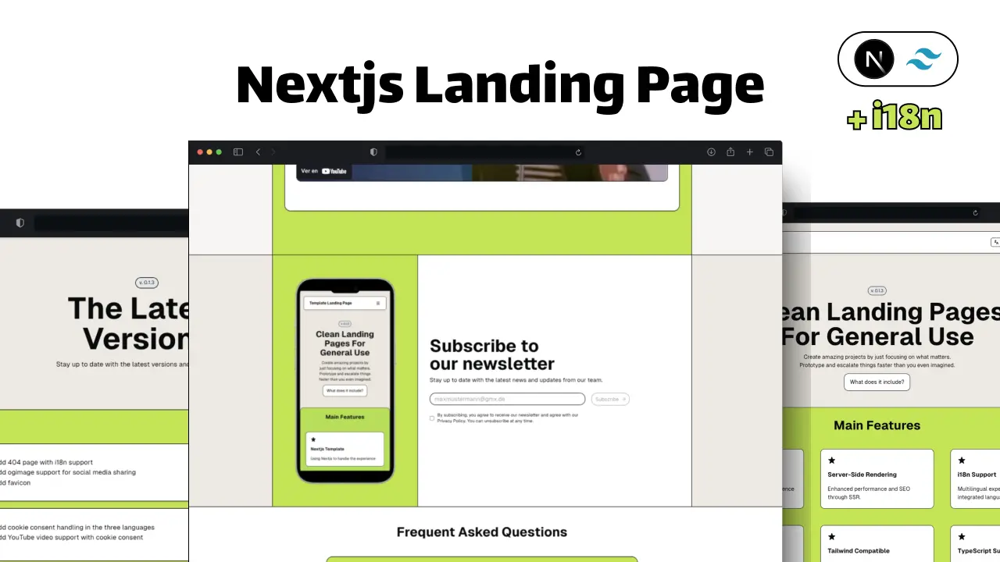

<div align="center">

<a href="https://manusansan.gumroad.com/l/template-landing-nextjs">
  
</a>

# Landing Page with Nextjs

[Gumroad Page](https://manusansan.gumroad.com/l/template-landing-nextjs)

</div>

## Key Features

- 🚀 Built with Next.js 15: Enjoy the latest Next.js capabilities, optimized for SEO and performance.

- 🌐 Multi-language Support: Integrated i18n and language switcher, providing seamless experiences for users in multiple languages. It comes already with English (default), German and Spanish support.

- 🎨 Styled with TailwindCSS and shadcn: Fast, modern styling using Tailwind, fully customizable to match your brand.

- 🔍 SEO Optimization: Preconfigured with SEO best practices to enhance discoverability.

- 💻 Server-Side Rendering: Ensures faster load times and improved search engine indexing.

- 💌 Formspree Integration: Contact form connected with Formspree for easy message handling.

- 📬 Buttondown Newsletter: Allow users to subscribe easily with Buttondown integration.

- 🔒 Cookie Consent Management: Compliant cookie banner setup, ready to adhere to GDPR regulations.

- ♿️ Accessible: 2.1 AA Standard considered!

- 🔄 404 Error Page and More: Custom 404 error page to guide users effectively, with additional built-in components for a complete user journey.

- 🔧 And More: Designed to simplify your workflow, with accessibility-first practices and responsive layouts for all devices.

- 🎁 ...much more

## How to configure

### Setup

You might probably need to use `npm i --legacy-peer-deps` since we are using very modern stuff with Nextjs 15 and other libraries like Framer Motion are still trying to adapt to it! Apart from that, I always recommend use `nvm use` to use the node lts version (see `.nvmrc`).

### Environment variables

Check out the `.env.example` file. We will need to copy it and create a `.env` file that will take the right values for the variables. This only applies if you want to use the Buttondown and Formspree as third parties.

```md
API_BUTTONDOWN=1234e2af-67bf-223a-211a-34c372912b52
NEXT_PUBLIC_NEWSLETTER_ENDPOINT=your_domain_here/api/newsletter
NEXT_PUBLIC_FORM=id_from_formspree_here
```

### i18n files

The project handles i18n pretty seamlessly. We are fetching the dictionary from the server in most of the times (only the 404 page fetches the dictionary from the client). We can see this server-side fetch in the `./app/[lang]/dictionaries.ts` file.

The project works by just passing the `dict` object (this is all the information regarding that locale) to the components that need it. In future versions, we might make use of a Context or some other state management technique, but I wanted to keep everything as server-side as possible.

Here you will see a list of the files that you will surely need to edit:

```md
app
├── [lang]
│ ├── dictionaries.ts // the file that fetches server-side the json files
│ ├── layout.tsx // the layout for all the pages but the 404 page
├── config
│ ├── index.ts // you have here some general settings + the navigation links
├── lib
│ ├── utils.ts // here you have a function that will handle the routing after locale properly
```

### Newsletter

This templates contemplated the use of [buttondown](https://buttondown.com/) as a newsletter manager. It is very easy to use and have a pretty reasonable free tier. You need to make sure that the flag for the newsletter is true and that you add you create a `.env` file with your API like in the `.env.example`. That's literally it!
